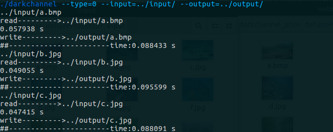
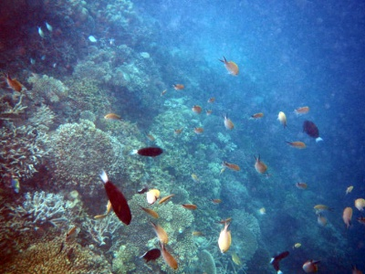
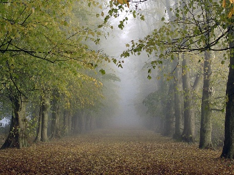

# 简介
该项目主要使用C++实现两个去雾算法，可以对图像和视频进行处理，并提供命令行界面进行交互。

---
## 两个去雾算法
### darkchannelPriorProcessor
该类实现了论文 [Single Image Haze Removal Using Dark Channel Prior](https://www.ncbi.nlm.nih.gov/pubmed/20820075)的暗通道先验去雾算法。
可以参考[src/darkchannelPriorProcessor.cpp](https://github.com/Sar-Kerson/dehazeProcessor/blob/master/src/darkchannelPriorProcessor.cpp)
的实现，该类主要有两个处理方法
```c++
void darkchannelPriorProcessor::process();
void darkchannelPriorProcessor::hazeFree();
```
process()方法求解了两个用于计算去雾结果的中间值，Atmosphere（大气光）跟Transmission（透视率）。具体过程
详见论文，这里不做赘述。

hazefree()方法则用Atmosphere与Transmission作运算得到结果图像。（公式13）

**RESULT: average 27fps for (400x300 video), ubuntu.16.04.amd64, core-i5-3200**

### nonLocalDehazeProcessor
该类实现了论文 [Non-local Image Dehazing](http://ieeexplore.ieee.org/document/7780554/?arnumber=7780554)。
代码可以参考[src/nonLocalDehazeProcessor.cpp](https://github.com/Sar-Kerson/dehazeProcessor/blob/master/src/nonLocalDehazeProcessor.cpp)
的实现。

该类主要有三个过程
```c++
void nonLocalDehazeProcessor::init(std::string sph_file);
void darkchannelPriorProcessor::process();
void darkchannelPriorProcessor::hazeFree();
```
init(std::string sph_file)方法用于读取给定的一个 NX2 矩阵，其中N为半径为1的球面所均分的节点数，
N越大，则球面的点越密集，聚类结果越精确（具体参见论文）。每个 1X2 的行向量代表一个点（经度、纬度）。
并用该矩阵初始化kd-tree，以在transmission的计算中，提高搜索速度（邻近的点为一个聚类）。

其余两个过程亦作如上一方法中的处理。**唯一的区别在于，Transmission的计算**。
具体可以查看[src/Transmission.cpp](https://github.com/Sar-Kerson/dehazeProcessor/blob/master/src/Transmission.cpp)

**RESULT: 7fps for (400x300 video), ubuntu.16.04.amd64, core-i5-3200**

### 处理方法的切换
你可以使用两种方法对图像作处理，只需一行代码：
```C++
	deHazeByNonLocalMethod(src, dst, "../TR_SPHERE_2500.txt");
	deHazeByDarkChannelPrior(src, dst);
```

## 使用方法
首先编译代码：
```
cd build
cmake ..
make
```
### 显示帮助
./darkchannel --help


### 处理单张图像
此命令将对单张输入图像进行处理并显示结果

./darkchannel --type=0 --input=../input/a.bmp 


### 批量处理图像
此命令将对input参数所指定目录下所有图片作处理，并输出到output所指定目录下

./darkchannel --type=0 --input=../input/ --output=../output/



### 处理视频并显示
此命令将对视频作实时处理，并将结果显示（示例使用第二个算法）

./darkchannel --type=1 --input=../data/breed.mp4


### 处理视频并写入
此命令将对input参数所指定视频文件做处理，并输出到output所指定文件（示例使用第一个算法）

./darkchannel --type=1 --input=../data/breed.mp4 --output=./out.avi


## 两种方法的对比
### 效果
左边算法一，右边算法二(2500个点的球面)
#### 



### 时间
**对于400x300的图片，运行环境为ubuntu.16.04.amd64, core-i5-3200**

算法一：
平均0.07s

算法二：
平均0.30s
## REFERNCES
[A Fast Single Image Haze Removal Algorithm Using Color Attenuation Prior](http://ieeexplore.ieee.org/abstract/document/7128396/)

[Single Image Haze Removal Using White Balancing and Saliency Map](http://www.sciencedirect.com/science/article/pii/S1877050915000435)

[The Next Best Underwater View](http://ieeexplore.ieee.org/document/7780778/)

[Optimized contrast enhancement for real-time image and video dehazing](http://www.sciencedirect.com/science/article/pii/S1047320313000242)
